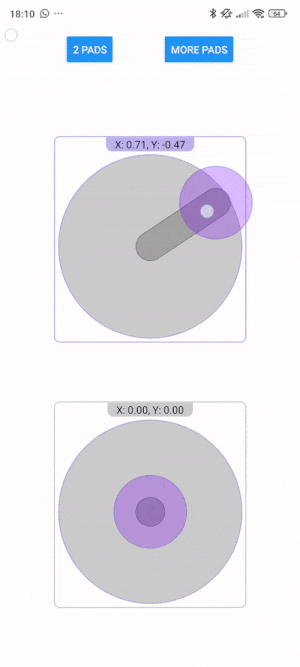

# @fustaro/react-native-axis-pad

Multi-touch axis / game pad for React Native.

Highly configurable:

- Round for 2 axis, or more like a horizontal or vertical slider for single axis
- Fully style-able background, control and stick
- Various types of "start" (prop `AxisPadProps.initialTouchType`)
  - "no-snap" (default) - Control knob will remain centered and your initial value will remain as {0, 0}. No callbacks will be called until a move.
  - "snap-to-value" - Control knob will snap to center on your initial touch. This position is treated as a value and will fire the onValue callback.
  - "visual-snap-to-center" - Entire pad will snap to center on your initial touch. The control knob remains centered in the pad and your initial value remains at {0, 0}. No callbacks will be called until a move.

See `AxisPadProps` for all options.

[Expo Snack](https://snack.expo.dev/@fustaro/fustaro-axis-pad-demo)



## Installation

```sh
npm install @fustaro/react-native-axis-pad react-native-gesture-handler
```

`react-native-gesture-handler` is required and a `GestureHandlerRootView` must be placed at the root of your app.

## Usage

```tsx
import { SafeAreaView } from "react-native";
import { AxisPad, AxisPadTouchEvent } from "@fustaro/react-native-axis-pad";
import { GestureHandlerRootView } from "react-native-gesture-handler";

export default function App() {
  const onTouchEvent = (event: AxisPadTouchEvent) => {
    if(event.eventType === "start"){
      // do something on event start
      console.log("start x", event.ratio.x, "start y", event.ratio.y);
    } else if(event.eventType === "end"){
      // do something on event end
      console.log("end x", event.ratio.x, "end y", event.ratio.y);
    } else if(event.eventType === "pan") {
      // do something while panning
      console.log("pan x", event.ratio.x, "pan y", event.ratio.y);
    }
  }

  return (
    <SafeAreaView style={styles.pageContainer}>
      <GestureHandlerRootView style={{ flex: 1 }}>
        <AxisPad
          id={"pad-1"}
          size={250}
          padBackgroundStyle={AxisPadStyles.padBackgroundStyle}
          stickStyle={AxisPadStyles.stickStyle}
          controlStyle={AxisPadStyles.controlStyle}
          ignoreTouchDownInPadArea={false}
          initialTouchType={"no-snap"}
          onTouchEvent={onTouchEvent}
        />
      </GestureHandlerRootView>
    </SafeAreaView>
  );
}
```

## Contributing

See the [contributing guide](CONTRIBUTING.md) to learn how to contribute to the repository and the development workflow.

## License

MIT

---

Made with [create-react-native-library](https://github.com/callstack/react-native-builder-bob)
